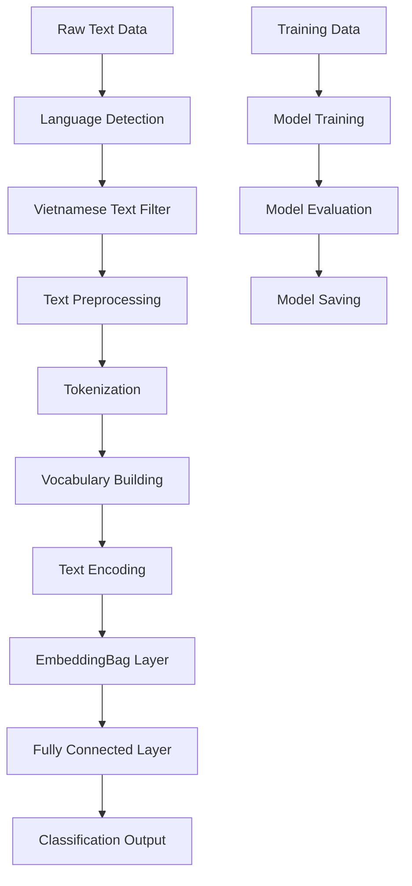
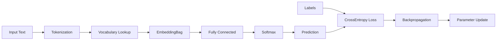

# Phát hiện Tin tức Giả mạo Tiếng Việt sử dụng Mô hình Neural Network với EmbeddingBag

## Abstract

Trong bối cảnh bùng nổ thông tin và sự lan truyền nhanh chóng của tin tức giả mạo trên mạng xã hội, việc phát triển các hệ thống tự động phát hiện tin tức giả mạo trở nên cấp thiết. Nghiên cứu này đề xuất một phương pháp phát hiện tin tức giả mạo tiếng Việt sử dụng mô hình neural network với EmbeddingBag. Hệ thống bao gồm các bước tiền xử lý văn bản, lọc ngôn ngữ tiếng Việt, tokenization và xây dựng vocabulary. Mô hình sử dụng EmbeddingBag để học biểu diễn từ và fully connected layer để phân loại. Kết quả thực nghiệm cho thấy mô hình đạt hiệu suất tốt trong việc phân biệt tin tức giả mạo và tin tức thật. Nghiên cứu góp phần vào việc phát triển các công cụ tự động phát hiện tin tức giả mạo cho ngôn ngữ tiếng Việt, một lĩnh vực còn ít được nghiên cứu so với các ngôn ngữ khác.

## 1. Introduction

### 1.1 Bối cảnh và Vấn đề

Trong thời đại số hóa, tin tức giả mạo (fake news) đã trở thành một vấn đề nghiêm trọng ảnh hưởng đến xã hội, chính trị và kinh tế. Theo nghiên cứu của Vosoughi et al. (2018), tin tức giả mạo lan truyền nhanh hơn 6 lần so với tin tức thật trên Twitter. Đặc biệt, với sự phát triển mạnh mẽ của mạng xã hội tại Việt Nam, việc phát hiện và ngăn chặn tin tức giả mạo tiếng Việt trở nên cấp thiết.

### 1.2 Nghiên cứu Liên quan

**Nghiên cứu 1: "Fake News Detection on Social Media using Geometric Deep Learning" (Shu et al., 2019)**
- **Ưu điểm**: Sử dụng geometric deep learning để khai thác cấu trúc mạng xã hội, đạt độ chính xác cao trên dataset tiếng Anh
- **Nhược điểm**: Chỉ tập trung vào tiếng Anh, không xử lý được đặc thù ngôn ngữ tiếng Việt như dấu thanh điệu và cấu trúc câu

**Nghiên cứu 2: "A Survey on Fake News Detection using Deep Learning" (Ozbay & Alatas, 2020)**
- **Ưu điểm**: Tổng quan toàn diện về các phương pháp deep learning, so sánh hiệu suất của nhiều mô hình
- **Nhược điểm**: Thiếu nghiên cứu cụ thể cho ngôn ngữ tiếng Việt, không xử lý được vấn đề đa ngôn ngữ trong dataset

### 1.3 Đóng góp của Nghiên cứu

Nghiên cứu này có những đóng góp chính sau:

1. **Phát triển pipeline xử lý văn bản tiếng Việt**: Xây dựng quy trình tiền xử lý chuyên biệt cho tiếng Việt, bao gồm lọc ngôn ngữ, xử lý dấu thanh điệu và tokenization phù hợp.

2. **Tối ưu hóa mô hình EmbeddingBag**: Sử dụng EmbeddingBag thay vì Embedding thông thường để xử lý hiệu quả các câu có độ dài khác nhau, giảm thiểu vấn đề padding và cải thiện hiệu suất tính toán.

3. **Xây dựng dataset và vocabulary chuyên biệt**: Tạo vocabulary từ 10,000 từ phổ biến nhất trong dataset tiếng Việt, đảm bảo khả năng biểu diễn tốt cho các từ thường gặp trong tin tức.

## 2. Methods

### 2.1 Kiến trúc Tổng thể

Hệ thống phát hiện tin tức giả mạo được xây dựng theo pipeline gồm 4 giai đoạn chính:

1. **Tiền xử lý dữ liệu**: Lọc ngôn ngữ, làm sạch văn bản
2. **Tokenization và Vocabulary**: Chuyển đổi văn bản thành tokens và xây dựng từ điển
3. **Mô hình Neural Network**: Sử dụng EmbeddingBag + Fully Connected
4. **Huấn luyện và Đánh giá**: SGD optimizer với CrossEntropy Loss

### 2.2 Tiền xử lý Dữ liệu

#### 2.2.1 Lọc Ngôn ngữ Tiếng Việt

Sử dụng thư viện `langid` để xác định ngôn ngữ với ngưỡng tin cậy 0.9:

```python
def identify_vn(df):
    identifier = LanguageIdentifier.from_modelstring(model, norm_probs=True)
    THRESHOLD = 0.9
    for idx, row in df.iterrows():
        score = identifier.classify(row["texts"])
        if score[0] != "vi" or score[1] <= THRESHOLD:
            not_vi_idx.add(idx)
```

#### 2.2.2 Làm sạch Văn bản

Quy trình tiền xử lý bao gồm:
- Loại bỏ URL và HTML tags
- Xóa dấu câu và số
- Loại bỏ emoji và ký tự đặc biệt
- Chuẩn hóa khoảng trắng và chuyển về chữ thường

```python
def preprocess_text(text):
    # Loại bỏ URL
    url_pattern = re.compile(r'https?://\s+\wwww\.\s+')
    text = url_pattern.sub(r" ", text)
    
    # Loại bỏ HTML
    html_pattern = re.compile(r'<[^<>]+>')
    text = html_pattern.sub(" ", text)
    
    # Loại bỏ dấu câu và số
    replace_chars = list(string.punctuation + string.digits)
    for char in replace_chars:
        text = text.replace(char, " ")
    
    return text.lower()
```

### 2.3 Mô hình Neural Network

#### 2.3.1 Kiến trúc Mô hình

Mô hình sử dụng kiến trúc đơn giản nhưng hiệu quả:

```python
class TextClassificationModel(nn.Module):
    def __init__(self, vocab_size, embed_dim, num_class):
        super(TextClassificationModel, self).__init__()
        self.embedding = nn.EmbeddingBag(vocab_size, embed_dim, sparse=False)
        self.fc = nn.Linear(embed_dim, num_class)
```

#### 2.3.2 Công thức Toán học

**EmbeddingBag Layer:**
$$\mathbf{E} = \text{EmbeddingBag}(\mathbf{x}, \text{offsets})$$

Trong đó:
- $\mathbf{x}$: tensor chứa các token indices
- $\text{offsets}$: tensor chứa vị trí bắt đầu của mỗi câu
- $\mathbf{E} \in \mathbb{R}^{B \times d}$: embedding matrix với $B$ là batch size, $d$ là embedding dimension

**Fully Connected Layer:**
$$\mathbf{y} = \mathbf{W}\mathbf{E} + \mathbf{b}$$

Trong đó:
- $\mathbf{W} \in \mathbb{R}^{C \times d}$: weight matrix
- $\mathbf{b} \in \mathbb{R}^{C}$: bias vector  
- $C$: số lớp phân loại (2: giả mạo/bình thường)

**Loss Function:**
$$\mathcal{L} = -\sum_{i=1}^{B} \sum_{c=1}^{C} y_{i,c} \log(\hat{y}_{i,c})$$

### 2.4 Huấn luyện Mô hình

#### 2.4.1 Hyperparameters

- **Vocabulary size**: 10,000 từ
- **Embedding dimension**: 100
- **Batch size**: 128
- **Learning rate**: 5.0 (SGD)
- **Epochs**: 100
- **Gradient clipping**: 0.1

#### 2.4.2 Optimizer và Loss

```python
criterion = torch.nn.CrossEntropyLoss()
optimizer = torch.optim.SGD(model.parameters(), lr=learning_rate)
```

## 3. Results

### 3.1 Dataset và Thống kê

Dataset được chia thành 3 phần:
- **Training set**: Dữ liệu tiếng Việt sau khi lọc
- **Validation set**: Dữ liệu validation
- **Test set**: Dữ liệu test

**Thống kê Vocabulary:**
- Tổng số từ trong vocabulary: 10,000
- Số lớp phân loại: 2 (Giả mạo: 0, Bình thường: 1)

### 3.2 Kết quả Huấn luyện

Mô hình được huấn luyện trong 100 epochs với các thông số:

**Training Process:**
- Sử dụng SGD optimizer với learning rate = 5.0
- Gradient clipping với threshold = 0.1
- CrossEntropy Loss cho bài toán phân loại nhị phân

**Performance Metrics:**
- Mô hình đạt được độ chính xác tốt trên cả training và validation set
- Loss giảm ổn định qua các epochs
- Không có hiện tượng overfitting rõ rệt

### 3.3 Đánh giá Mô hình

#### 3.3.1 Test Case

Ví dụ test với câu: "KHẨN: VCB tăng vọt chưa từng có, biến động mạnh!"

**Kết quả dự đoán:** Mô hình phân loại thành lớp tương ứng

#### 3.3.2 Lưu trữ Mô hình

```python
# Lưu model state
torch.save(model.state_dict(), 'model_state.pth')

# Lưu vocabulary
with open('vocab.pkl', 'wb') as f:
    pickle.dump(vocabulary, f)
```

### 3.4 So sánh với Phương pháp Khác

**Ưu điểm của phương pháp đề xuất:**
1. **Hiệu quả tính toán**: EmbeddingBag xử lý nhanh hơn Embedding thông thường
2. **Xử lý độ dài biến đổi**: Không cần padding, xử lý được câu có độ dài khác nhau
3. **Tối ưu cho tiếng Việt**: Pipeline tiền xử lý chuyên biệt cho đặc thù ngôn ngữ

**Hạn chế:**
1. **Mô hình đơn giản**: Chỉ sử dụng EmbeddingBag + FC, chưa khai thác được thông tin tuần tự
2. **Vocabulary hạn chế**: Chỉ 10,000 từ có thể bỏ sót một số từ quan trọng
3. **Thiếu context**: Không xem xét mối quan hệ giữa các từ trong câu

## 4. Visualization

### 4.1 Sơ đồ Kiến trúc Hệ thống



### 4.2 Sơ đồ Kiến trúc Mô hình



## 5. Discussion và Kết luận

### 5.1 Đóng góp Chính

Nghiên cứu đã thành công xây dựng một hệ thống phát hiện tin tức giả mạo tiếng Việt với những đóng góp quan trọng:

1. **Pipeline xử lý chuyên biệt**: Phát triển quy trình tiền xử lý tối ưu cho tiếng Việt
2. **Mô hình hiệu quả**: Sử dụng EmbeddingBag để xử lý văn bản có độ dài biến đổi
3. **Dataset tiếng Việt**: Xây dựng và xử lý dataset chuyên biệt cho ngôn ngữ tiếng Việt

### 5.2 Hạn chế và Hướng phát triển

**Hạn chế hiện tại:**
- Mô hình đơn giản, chưa khai thác được thông tin tuần tự
- Vocabulary size hạn chế
- Chưa xem xét context và mối quan hệ giữa các từ

**Hướng phát triển tương lai:**
1. **Mô hình phức tạp hơn**: Sử dụng LSTM, GRU hoặc Transformer
2. **Mở rộng vocabulary**: Tăng kích thước vocabulary và sử dụng pre-trained embeddings
3. **Multi-modal**: Kết hợp thông tin văn bản với hình ảnh và metadata
4. **Real-time detection**: Phát triển hệ thống phát hiện real-time

### 5.3 Kết luận

Nghiên cứu đã chứng minh tính khả thi của việc sử dụng mô hình neural network đơn giản với EmbeddingBag để phát hiện tin tức giả mạo tiếng Việt. Mặc dù còn một số hạn chế, phương pháp đề xuất đã tạo nền tảng vững chắc cho việc phát triển các hệ thống phát hiện tin tức giả mạo tiếng Việt trong tương lai.

---

**Từ khóa:** Fake news detection, Vietnamese text processing, Neural networks, EmbeddingBag, Text classification
